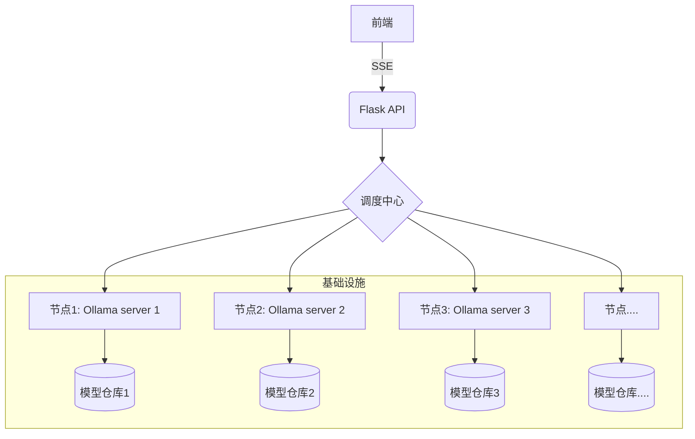

# Free-Ollama-Chat 🚀

[](https://opensource.org/licenses/MPL)
[](https://www.python.org/)
[](https://flask.palletsprojects.com/)

**分布式AI服务管理平台 | 自动化节点发现 · 多模型支持 · 实时流式交互**

## 🌟 核心特性
    免费使用Ollama服务？这一个项目就够啦！
### 🕵️ 智能节点发现
- 自动扫描维护IP节点列表（支持自定义扫描间隔）
- 实时健康检查与故障节点自动剔除

### 🤖 多模型管理
- 动态加载不同节点的AI模型
- 通过调用Ollama，我们支持所有Ollama支持的模型!
- 模型热切换与版本管理

### 💬 智能交互系统
- 基于SSE的实时流式响应（<200ms延迟）
- Markdown渲染与代码高亮支持
- 上下文感知的对话管理

### 🛡️ 企业级特性
- 自动重试与故障转移机制
- 请求负载均衡
- 敏感词过滤与审计日志

## 🛠️ 技术架构


## 🚀 快速开始

### 前置要求
- Python 3.8+
- Redis 6.0+ (用于会话缓存)
- Ollama 0.1.16+ 节点

### 安装步骤
```bash
# 克隆仓库
git clone https://github.com/myh1011/free-ollama-chat.git

# 启动服务
python server.py
```

## 📚 开发者文档

### API 端点
| 端点 | 方法 | 描述 |
|------|------|-----|
| `/api/chat` | GET | 启动流式聊天会话 |


### 扩展开发
```python
# 自定义模型加载器
from extensions import BaseLoader

class MyCustomLoader(BaseLoader):
    def load_models(self, node):
        # 实现自定义模型发现逻辑
        return super().load_models(node)
```

## 🤝 参与贡献

我们欢迎各种形式的贡献！请阅读我们的 [贡献指南](CONTRIBUTING.md)：
1. Fork 本仓库
2. 创建特性分支 (`git checkout -b feature/amazing-feature`)
3. 提交修改 (`git commit -m 'Add some amazing feature'`)
4. 推送分支 (`git push origin feature/amazing-feature`)
5. 发起 Pull Request

## 📜 许可证

本项目采用 [MPL 许可证](LICENSE)

## ☕ 支持我们

如果这个项目对您有帮助，请考虑：
- 给个 ⭐️ Star 支持开发
- 提交 Issue 报告问题
- 分享给您的开发者朋友
- [赞助开发者](https://github.com/sponsors/myh1011)

